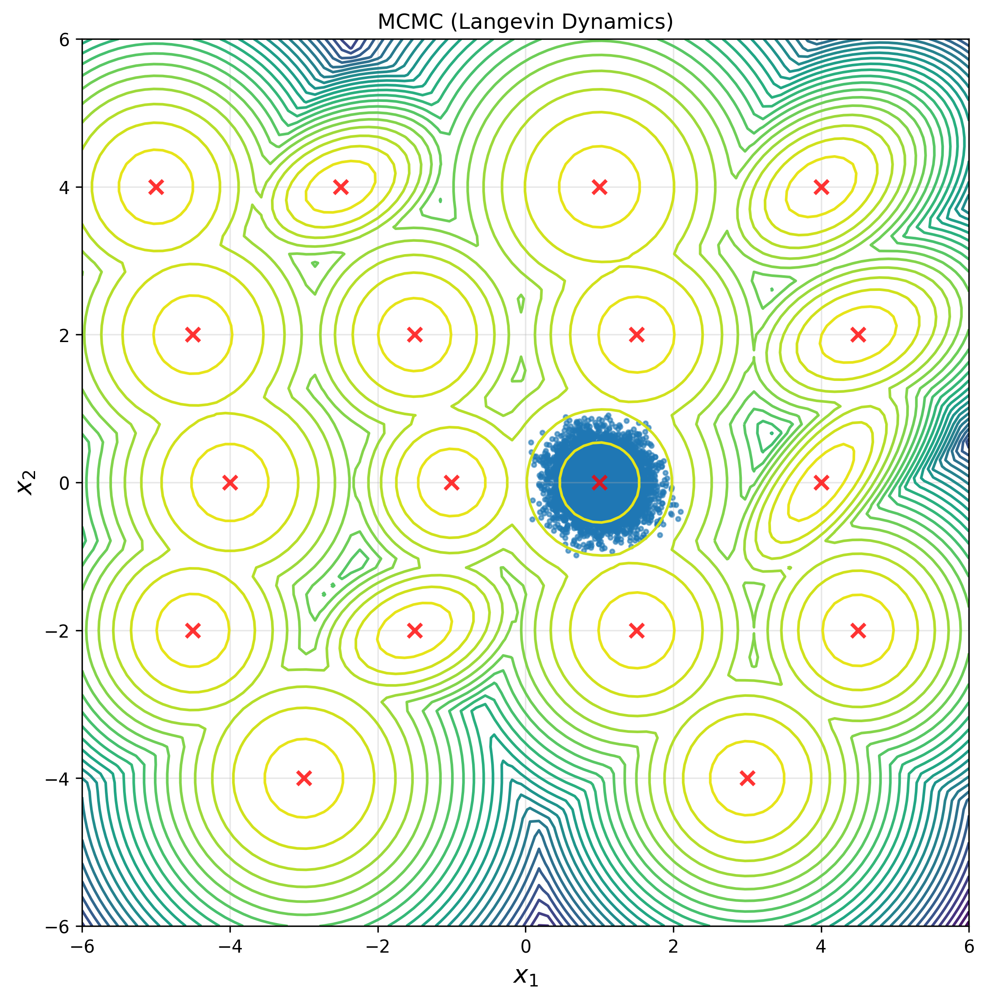
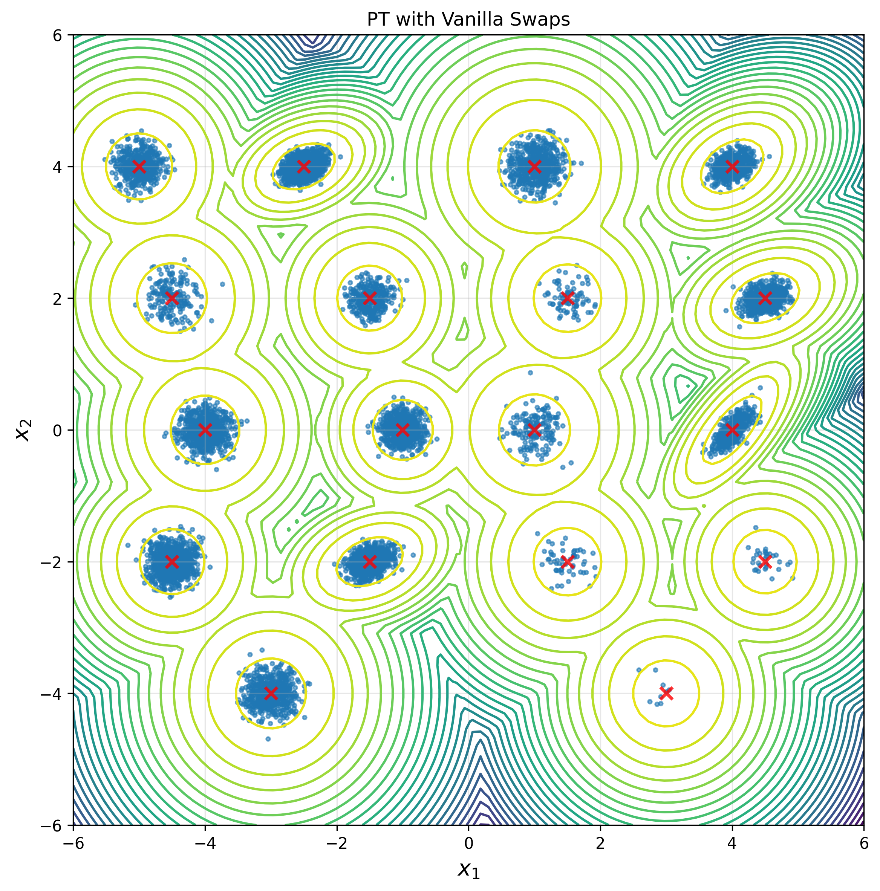
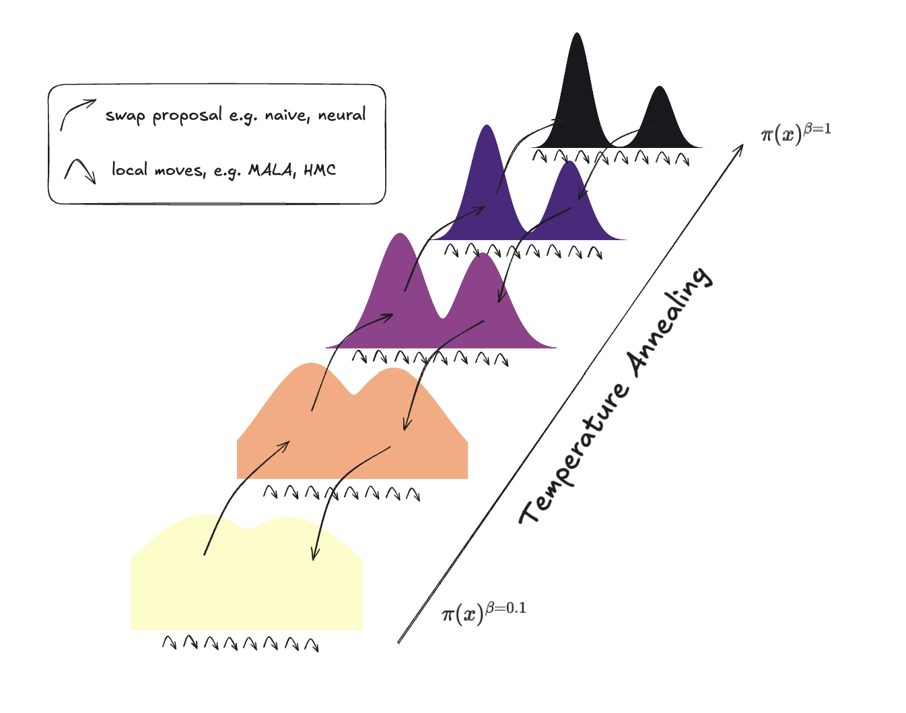

# Accelerating Parallel Tempering with Generative Models

## Problem: Sampling Unnormalized Densities

We need representative samples from high-dimensional targets that are known only up to a constant. 

For an $N$-atoms molecular system with coordinates $x \in \Omega \subset \mathbb{R}^{3N}$ and energy $U(x)$, the Boltzmann density is

$$
\mu_\beta(x) \propto \exp(-\beta\,U(x)),\quad \beta = (k_B T)^{-1},
$$

where $T$ is temperature and $k_B$ the Boltzmann constant. The normalizing constant (partition function) is intractable, so **sampling** is the task.

## Local MCMC: 

Classical MCMC methods (e.g. MALA, HMC) explore well near the current state but struggle to leave metastable basins in high dimensions. In practice, this causes mode collapse and poor mixing (e.g. see left figure).

<div align="center">
  
  
</div>

## Parallel Tempering (PT): 

PT runs multiple replicas across a temperature ladder. Hot replicas cross barriers more easily, and **replica swaps** let the cold replica inherit diverse states. A Metropolis–Hastings correction keeps sampling exact. This induces better exploration and mixing (e.g. see right figure above). For intuitive understanding, see the figure below.

<div align="center">
  
</div>

However, PT helps when **neighboring temperatures overlap**. In high dimensions this overlap collapses (e.g. the curse of dimensionality), swap acceptance falls, and we must add many closely spaced replicas, raising computational cost.

## Our Approach:

Instead of swapping raw coordinates, we **learn an invertible transport** between adjacent temperatures and swap the transported states. This **engineers overlap** at practical temperature gaps, raises swap acceptance, while keeping exactness via the usual MH correction.

## Architectures: 

- **PTSwapFlow** — coordinate-only RealNVP; fast. peptide-specific baseline.  
- **PTSwapGraphFlow** — message passing on radius graphs; uses atom types and neighborhoods; permutation-equivariant and rotation-aware.  
- **PTSwapTransformerFlow** — global attention in augmented (coordinates + auxiliary velocities) space for long-range couplings.

## Goal in Future Work:

A **transferable** neural transport that generalizes **across peptides and temperature pairs**. The model is conditioned on the temperature pair so one trained system can be reused along the ladder and across related systems.

---

## Codebase:


### Environment

```bash
conda env create -f environment.yml
conda activate accelmd
```

### Data layout

Place PT dipeptide datasets under `datasets/pt_dipeptides/<PEP>/` with:

```text
pt_<PEP>.pt          # PT trajectory tensor or dict (see shapes below)
atom_types.pt        # LongTensor [N] with atom type indices
adj_list.pt          # LongTensor [E,2] or [2,E] edges 
ref.pdb              # Reference PDB (used for dipeptide target)
```

PT tensor formats supported by the loader:
- [temps, chains, steps, coords] with coords = 3N
- [steps*chains, temps, coords]

Coordinates are reshaped to [B, N, 3]; optional preprocessing: centering, chirality filtering, random rotation augmentation.

### What’s implemented

- Training/evaluation via `main.py`
- Single-peptide and multi-peptide modes
- Architectures: simple (`PTSwapFlow`), graph (`PTSwapGraphFlow`), transformer (`PTSwapTransformerFlow`)
- Physics bases: generic dipeptide potential (implicit solvent). Energies run on CPU.
- Output management per temperature pair with best-checkpoint tracking

### Quick start

Single peptide (e.g., AA) using the simple flow:

```bash
conda activate accelmd && python -u main.py --config configs/AA_simple.yaml --temp-pair 0 1 
```

Multi‑peptide training (graph or transformer only):

```bash
conda activate accelmd && python -u main.py --config configs/multi_graph.yaml --temp-pair 0 1
```

Evaluate a saved checkpoint and report swap acceptance (prints mean ± CI over resampled sets):

```bash
conda activate accelmd && python -u main.py --config configs/multi_transformer.yaml \
  --evaluate --temp-pair 0 1 \
  --checkpoint outputs/<experiment>/pair_0_1/models/best_model_epochXXX.pt \
  --num-eval-samples 20000 --eval-repeats 5
```

Omit `--temp-pair` to iterate through all pairs listed in the config.

### License

MIT
